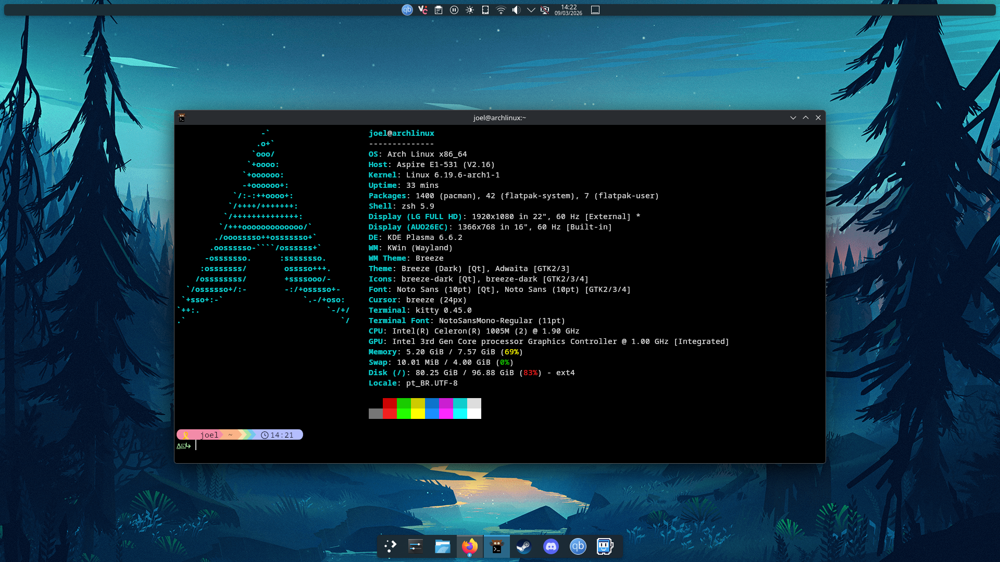

# soul_f-dotfiles

  

  

  


Screenshot of my desktop:



🇧🇷 **Português (Brasil)**

Este repositório contém meus **dotfiles** do Linux.
Aqui ficam meus arquivos de configuração pessoais usados no meu sistema (principalmente Arch Linux).

Inclui configurações do shell, editores, terminal, window managers, aplicativos e muito mais.

---

🇺🇸 **English**

This repository contains my personal **Linux dotfiles**.
These are the configuration files I use on my system (mainly Arch Linux).

It includes configurations for my shell, editors, terminal, window managers, applications, and more.

---

## 📁 Structure / Estrutura

```
~
├── .bashrc
├── .zshrc
├── .zshrc.pre-oh-my-zsh
└── .config
    ├── nvim
    ├── kitty
    ├── hypr
    ├── rofi
    ├── mpv
    ├── btop
    ├── fastfetch
    ├── neofetch
    ├── starship.toml
    ├── obsidian
    ├── vlc
    ├── retroarch
    ├── qBittorrent
    └── ... (many other application configs)
```

*(Folder names above are shortened examples of the real structure./ Os nomes das pastas acima são exemplos encurtados da estrutura real)*

---

## ⚙️ Programs I use / Programas que eu uso

🇧🇷 Alguns programas nesse repositório incluem:

🇺🇸 Some programs configured in this repo include:

* Zsh
* Neovim
* Kitty
* Hyprland
* Rofi
* Btop
* Fastfetch
* Obsidian
* RetroArch

---

## 📦 Notes / Notas

🇧🇷 Esses arquivos são minhas configurações pessoais, então podem mudar com frequência e talvez não funcionem perfeitamente em outros sistemas sem alguns ajustes.

🇺🇸 These files are my personal configuration files, so they may change frequently and may not work perfectly on other systems without adjustments.
